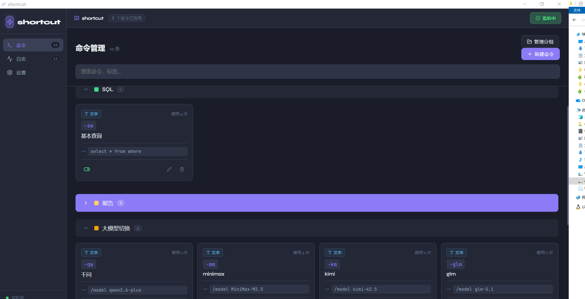

# Shortcut - 快捷命令工具 | Quick Command Tool

<p align="center">
  
</p>

<p align="center">
  <a href="https://tauri.app"></a>
  <a href="https://react.dev"></a>
  <a href="https://www.rust-lang.org"></a>
  <a href="https://www.typescriptlang.org"></a>
</p>

<p align="center">
  <b>中文</b> | <a href="#english">English</a>
</p>

---

## 📖 简介

**Shortcut** 是一款跨平台的桌面快捷命令工具，通过简单的触发词即可快速执行各种操作，提升您的工作效率。

<p align="center">
  
</p>

### ✨ 核心特性

- 🚀 **快捷触发** - 输入触发词（如 `-date`）即可自动执行命令
- 📝 **文本替换** - 支持变量扩展（`{{date}}`, `{{time}}`, `{{datetime}}` 等）
- 🔗 **快速打开** - 一键打开网址或启动应用程序
- 📅 **日期插入** - 快速插入当前日期或时间
- 📂 **分组管理** - 对命令进行分类管理，井井有条
- 🎯 **全局监听** - 后台运行，随时响应您的指令
- 🖥️ **系统托盘** - 最小化到托盘，不占用桌面空间
- 📊 **活动日志** - 记录命令执行历史，方便追踪

---

## 🚀 快速开始

### 环境要求

- [Node.js](https://nodejs.org/) 18+
- [Rust](https://www.rust-lang.org/tools/install) 1.70+

### 安装依赖

```bash
# 安装前端依赖
npm install

# 安装 Tauri CLI
npm install -g @tauri-apps/cli
```

### 开发运行

```bash
# 启动开发服务器
npm run tauri dev
```

### 构建发布

```bash
# 构建生产版本
npm run tauri build
```

构建完成后，安装包将位于 `src-tauri/target/release/bundle/` 目录。

---

## 📚 使用指南

### 创建命令

1. 打开应用，点击「新建命令」
2. 设置触发词（如 `-email`）
3. 选择命令类型：
   - **文本** - 替换为指定文本内容
   - **日期** - 插入当前日期/时间
   - **URL** - 打开指定网址
   - **应用** - 启动指定程序
4. 保存后即可使用

### 触发命令

在任何输入框中输入触发词，按空格、回车或 Tab 键即可触发：

```
输入: 今天是 -date
输出: 今天是 2024-01-15
```

### 文本变量

支持以下变量占位符：

| 变量 | 说明 | 示例 |
|------|------|------|
| `{{date}}` | 当前日期 | 2024-01-15 |
| `{{datetime}}` | 当前日期时间 | 2024-01-15 14:30:00 |
| `{{time}}` | 当前时间 | 14:30 |
| `{{timestamp}}` | 时间戳 | 1705312200000 |

---

## 🏗️ 项目结构

```
shortcut/
├── src/                    # 前端源码 (React + TypeScript)
│   ├── components/         # React 组件
│   ├── App.tsx            # 主应用组件
│   ├── types.ts           # TypeScript 类型定义
│   ├── commandStore.ts    # 命令数据存储
│   ├── keyboardHook.ts    # 键盘事件处理
│   └── executor.ts        # 命令执行器
├── src-tauri/             # Tauri 后端 (Rust)
│   ├── src/
│   │   └── lib.rs         # 核心逻辑
│   ├── Cargo.toml         # Rust 依赖配置
│   └── tauri.conf.json    # Tauri 配置
├── package.json           # Node.js 依赖配置
└── vite.config.ts         # Vite 配置
```

---

## 🛠️ 技术栈

- **前端框架**: [React 18](https://react.dev) + [TypeScript](https://www.typescriptlang.org)
- **构建工具**: [Vite](https://vitejs.dev)
- **桌面框架**: [Tauri v2](https://tauri.app)
- **后端语言**: [Rust](https://www.rust-lang.org)
- **全局键盘监听**: [rdev](https://github.com/Narsil/rdev)
- **模拟输入**: [enigo](https://github.com/enigo-rs/enigo)
- **剪贴板**: [arboard](https://github.com/1Password/arboard)

---

## 🤝 贡献

欢迎提交 Issue 和 Pull Request！

1. Fork 本仓库
2. 创建您的特性分支 (`git checkout -b feature/AmazingFeature`)
3. 提交您的更改 (`git commit -m 'Add some AmazingFeature'`)
4. 推送到分支 (`git push origin feature/AmazingFeature`)
5. 打开一个 Pull Request

---

## 📄 许可证

本项目基于 [MIT](LICENSE) 许可证开源。

---

<p align="center">
  Made with ❤️ using Tauri + React + Rust
</p>

---

<h1 id="english">Shortcut - Quick Command Tool</h1>

<p align="center">
  <b>English</b> | <a href="#">中文</a>
</p>

---

## 📖 Introduction

**Shortcut** is a cross-platform desktop quick command tool that boosts your productivity by executing various actions through simple trigger words.

### ✨ Key Features

- 🚀 **Quick Trigger** - Type trigger words (e.g., `-date`) to execute commands automatically
- 📝 **Text Expansion** - Support variable expansion (`{{date}}`, `{{time}}`, `{{datetime}}`, etc.)
- 🔗 **Quick Open** - Open URLs or launch applications with one click
- 📅 **Date Insertion** - Quickly insert current date or time
- 📂 **Group Management** - Organize commands into categories
- 🎯 **Global Listener** - Run in background, always ready for your commands
- 🖥️ **System Tray** - Minimize to tray, save desktop space
- 📊 **Activity Log** - Track command execution history

---

## 🚀 Quick Start

### Prerequisites

- [Node.js](https://nodejs.org/) 18+
- [Rust](https://www.rust-lang.org/tools/install) 1.70+

### Install Dependencies

```bash
# Install frontend dependencies
npm install

# Install Tauri CLI
npm install -g @tauri-apps/cli
```

### Development

```bash
# Start development server
npm run tauri dev
```

### Build

```bash
# Build for production
npm run tauri build
```

After building, the installer will be located in `src-tauri/target/release/bundle/`.

---

## 📚 Usage Guide

### Create a Command

1. Open the app, click "New Command"
2. Set a trigger word (e.g., `-email`)
3. Select command type:
   - **Text** - Replace with specified text content
   - **Date** - Insert current date/time
   - **URL** - Open specified URL
   - **App** - Launch specified application
4. Save and start using

### Trigger Commands

Type the trigger word in any input field, then press Space, Enter, or Tab:

```
Input: Today is -date
Output: Today is 2024-01-15
```

### Text Variables

The following variable placeholders are supported:

| Variable | Description | Example |
|----------|-------------|---------|
| `{{date}}` | Current date | 2024-01-15 |
| `{{datetime}}` | Current date and time | 2024-01-15 14:30:00 |
| `{{time}}` | Current time | 14:30 |
| `{{timestamp}}` | Timestamp | 1705312200000 |

---

## 🏗️ Project Structure

```
shortcut/
├── src/                    # Frontend source (React + TypeScript)
│   ├── components/         # React components
│   ├── App.tsx            # Main app component
│   ├── types.ts           # TypeScript type definitions
│   ├── commandStore.ts    # Command data storage
│   ├── keyboardHook.ts    # Keyboard event handling
│   └── executor.ts        # Command executor
├── src-tauri/             # Tauri backend (Rust)
│   ├── src/
│   │   └── lib.rs         # Core logic
│   ├── Cargo.toml         # Rust dependencies
│   └── tauri.conf.json    # Tauri configuration
├── package.json           # Node.js dependencies
└── vite.config.ts         # Vite configuration
```

---

## 🛠️ Tech Stack

- **Frontend**: [React 18](https://react.dev) + [TypeScript](https://www.typescriptlang.org)
- **Build Tool**: [Vite](https://vitejs.dev)
- **Desktop Framework**: [Tauri v2](https://tauri.app)
- **Backend**: [Rust](https://www.rust-lang.org)
- **Global Keyboard**: [rdev](https://github.com/Narsil/rdev)
- **Input Simulation**: [enigo](https://github.com/enigo-rs/enigo)
- **Clipboard**: [arboard](https://github.com/1Password/arboard)

---

## 🤝 Contributing

Contributions are welcome! Please feel free to submit issues and pull requests.

1. Fork the repository
2. Create your feature branch (`git checkout -b feature/AmazingFeature`)
3. Commit your changes (`git commit -m 'Add some AmazingFeature'`)
4. Push to the branch (`git push origin feature/AmazingFeature`)
5. Open a Pull Request

---

## 📄 License

This project is licensed under the [MIT](LICENSE) License.

---

<p align="center">
  Made with ❤️ using Tauri + React + Rust
</p>
